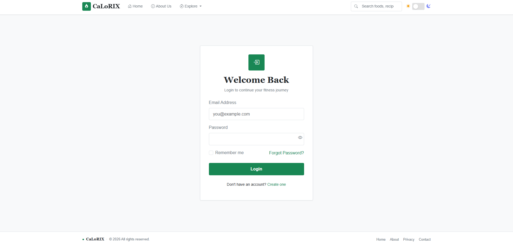

# Calorix

A Django-based web application for calorie tracking, nutrition management, and health monitoring.

## Features

* User Registration and Login
* Dashboard for tracking health metrics
* Calorie and nutrition monitoring
* Responsive user interface
* Secure authentication system

## Tech Stack

* Python
* Django
* HTML5
* CSS3
* Bootstrap
* SQLite

## Screenshots

### Home Page


### Login Page



### Dashboard


## Project Structure

```text
calorix/
├── manage.py
├── requirements.txt
├── calorix/
├── home/
├── dashboard/
├── static/
└── templates/
```

## Installation

### Clone the Repository

```bash
git clone https://github.com/YOUR_USERNAME/calorix.git
cd calorix
```

### Create a Virtual Environment

```bash
python -m venv venv
```

### Activate the Virtual Environment

Windows:

```bash
venv\Scripts\activate
```

### Install Dependencies

```bash
pip install -r requirements.txt
```

### Apply Migrations

```bash
python manage.py migrate
```

### Run the Development Server

```bash
python manage.py runserver
```

Open your browser and visit:

```text
http://127.0.0.1:8000/
```

## Future Enhancements

* BMI Calculator
* BMR Calculator
* Meal Planning
* Progress Charts

## Author

Vansh Saini

## License

This project is for educational and portfolio purposes.
